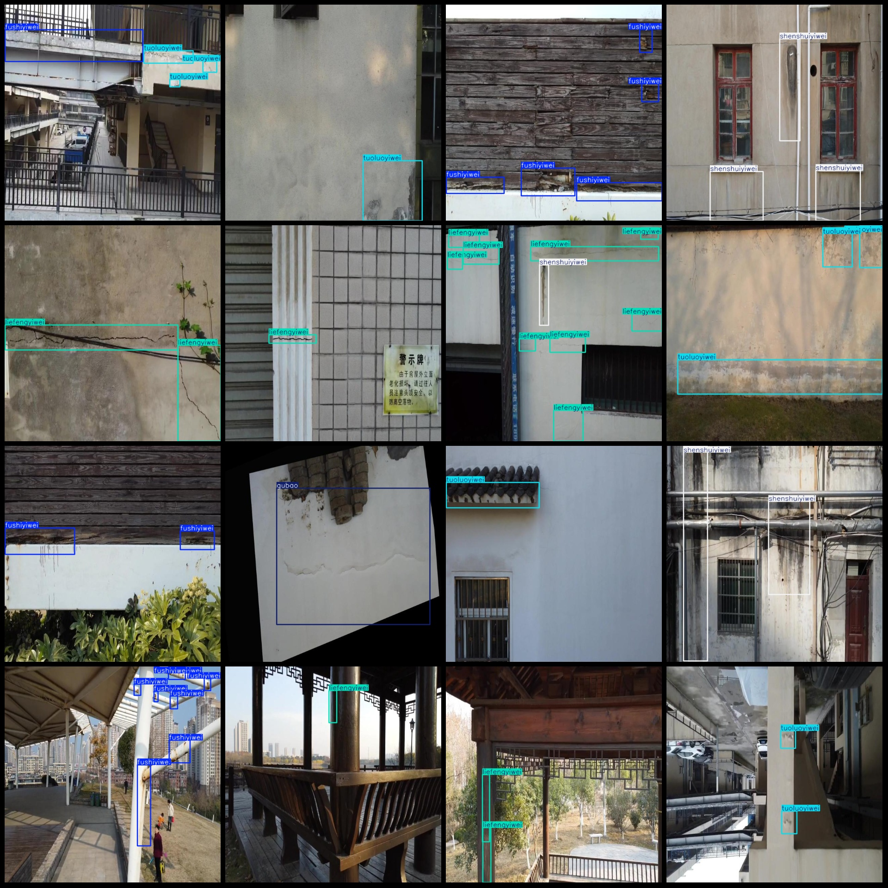
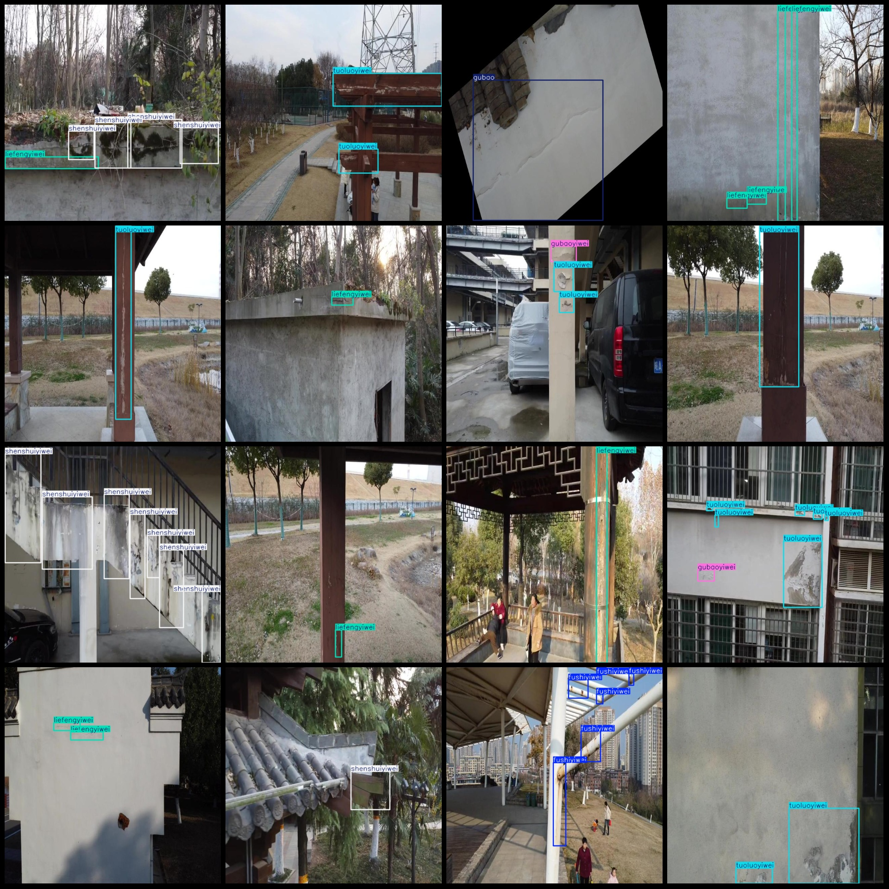

# Drone Viewpoint Building Surface Cracks, Bubbles, and Defect Detection Dataset VOC+YOLO Format with 14295 Images in 6 Categories

Note: The dataset is composed of multiple video clips captured by a DJI MAVIC 3 drone. The dataset format is Pascal VOC and YOLO (without split path txt files, only include jpg images and corresponding VOC xml files and yolo txt files).

- number of images: 14295 images
- annotation count: 14295 images
- annotation count: 14295 images
- number of annotations: 6
- annotation class names:["fushiyiwei", "gubao", "gubaoyiwei", "liefengyiwei", "shenshuiyiwei", "tuoluoyiwei"]
- Corresponding Chinese category names: ["Corrosion Shift", "Bubbles", "Bubbles Shift", "Crack Shift", "Leakage Shift", "Delamination Shift"]
- boxes per class: 
- fushiyiwei = 9207
- Gubao Frame Count = 534
- Gubaoyiwei's frame count = 1317
    - liefengyiwei box count = 17040
- shenshuiyiwei frame number = 6642
- Tuoluoyiwei frame count = 22699
- total boxes: 57439
- images per class: 
- Fushiyiwei occupies a total of 2102 images
    - Gubao occupies a total of 534 images
    - Gubaoyiwei occupies a total of 636 images
    - Liefengyiwei occupies a total of 6252 images
    - Shenshuiyiwei occupies a total of 2464 images
    - Tuoluoyiwei occupies a total of 5164 images
- Image resolution: 640x640 pixels
- Tool used for labeling: labelImg
- Labeling rules: A rectangle box is drawn around the category.
- Note: The dataset does not have separate training, validation, or test sets; you will need to divide it yourself.
- Special Disclaimer: This dataset does not guarantee any accuracy in the trained model or weight files.

annotation example:

| Class | Box Count | Image Count |
|-----|------|-------|
| fushiyiwei | 9207 | 2102 |
| gubao | 534 | 534 |
| gubaoyiwei | 1317 | 636 |
| liefengyiwei | 17040 | 6252 |
| shenshuiyiwei | 6642 | 2464 |
| tuoluoyiwei | 22699 | 5164 |
## Images

Here is a pay link on Stripe ( https://buy.stripe.com/3cs8yP7sY87d0vu9AB ). Please contact me lonlonago@foxmail.com after funding $89, and I will send you a complete data files , thank you!

